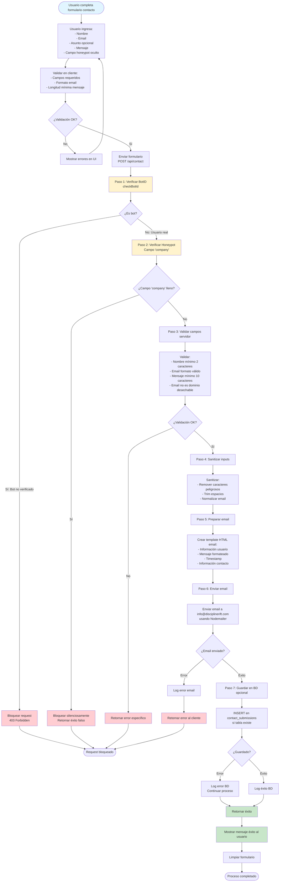
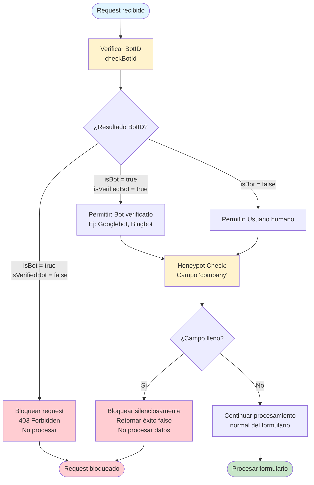
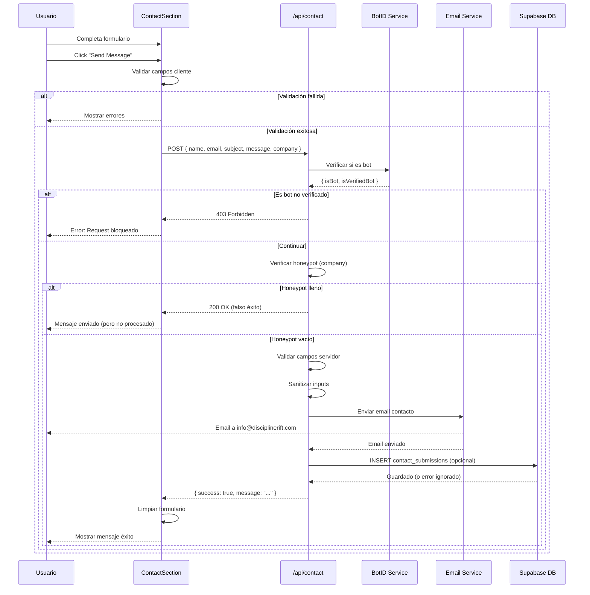
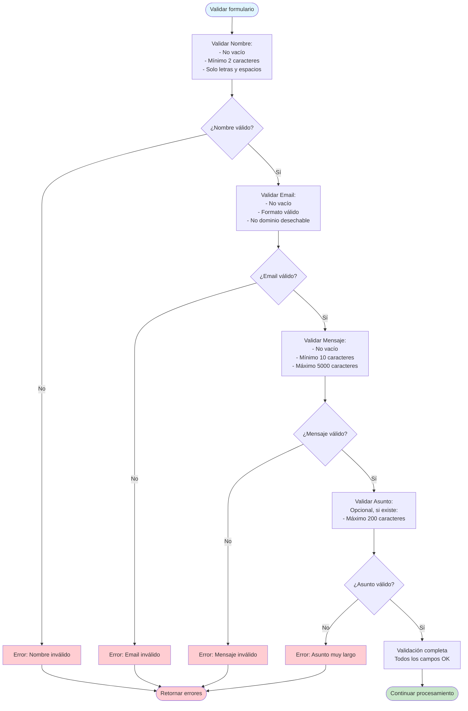
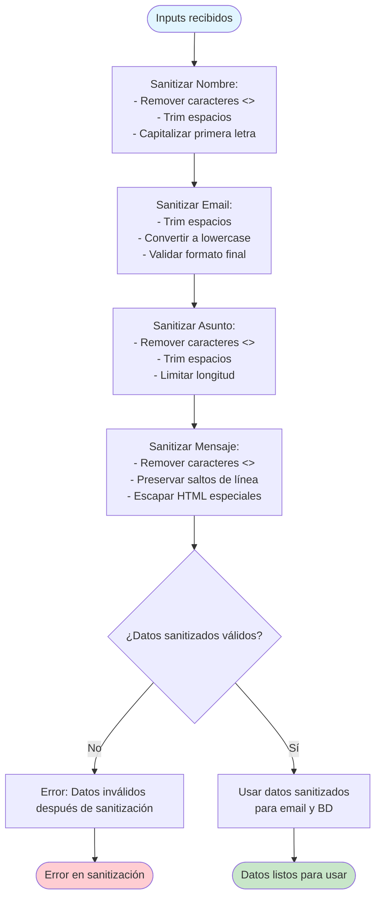

# Formulario de Contacto

Este documento describe el proceso de envío del formulario de contacto, incluyendo validación anti-spam (BotID + Honeypot) y envío de email.

## Descripción

El formulario de contacto permite a los usuarios enviar mensajes a Discipline Rift. Incluye protección anti-spam mediante BotID y campo honeypot, validación de campos, sanitización de inputs y envío de emails mediante Gmail SMTP.

## Diagrama de Flujo Principal: Proceso de Envío de Formulario

## Diagrama de Decisión: Validación Anti-Spam (BotID + Honeypot)

## Diagrama de Secuencia: Envío de Email de Contacto

## Diagrama de Validación de Campos

## Diagrama de Proceso de Sanitización

## Referencias de Archivos

### Componentes
- `components/contact-section.tsx` - Componente del formulario de contacto
- `app/contact/page.tsx` - Página de contacto

### API Routes
- `app/api/contact/route.ts` - Endpoint de procesamiento del formulario

### Servicios
- `components/botid-client.tsx` - Cliente BotID para detección de bots
- `lib/email-service.ts` - Servicio de envío de emails (si existe)

### Base de Datos
- Tabla `contact_submissions` (opcional) con campos:
  - `name`
  - `email`
  - `subject`
  - `message`
  - `submitted_at`
  - `status`

## Notas Importantes

### Protección Anti-Spam

1. **BotID**: Servicio externo que detecta bots y tráfico automatizado.
2. **Honeypot Field**: Campo oculto "company" que los bots llenan pero los humanos no.
3. **Doble Verificación**: Se usan ambas técnicas para máxima protección.
4. **Bots Verificados**: Se permiten bots de motores de búsqueda (Googlebot, Bingbot).
5. **Bloqueo Silencioso**: Los bots bloqueados reciben respuesta de éxito para no alertarlos.

### Validaciones

1. **Cliente y Servidor**: Validación en ambos lados para mejor UX y seguridad.
2. **Longitud Mínima**: Campos tienen longitudes mínimas para prevenir spam de baja calidad.
3. **Dominios Desechables**: Se valida que el email no sea de dominio desechable conocido.
4. **Sanitización**: Todos los inputs se sanitizan antes de usar.

### Manejo de Errores

1. **Errores Específicos**: Se retornan mensajes de error específicos para cada tipo de validación.
2. **Errores de Email**: Los errores de envío de email no bloquean la respuesta al usuario.
3. **Errores de BD**: Los errores de guardado en BD se registran pero no bloquean el proceso.
4. **Feedback al Usuario**: Se muestra feedback claro sobre éxito o error.

### Privacidad y Seguridad

1. **Datos Sensibles**: Los mensajes pueden contener información sensible, se manejan con cuidado.
2. **Almacenamiento**: Los mensajes se almacenan en BD solo si la tabla existe (opcional).
3. **Email Seguro**: Los emails se envían de forma segura usando SMTP autenticado.
4. **Sin Exposición**: Los datos del formulario no se exponen en URLs o logs.

### UX

1. **Feedback Inmediato**: Validación en tiempo real en el cliente.
2. **Mensajes Claros**: Mensajes de error y éxito claros y accionables.
3. **Limpieza Automática**: El formulario se limpia automáticamente después de envío exitoso.
4. **Estados de Carga**: Se muestra estado de carga durante el envío.

