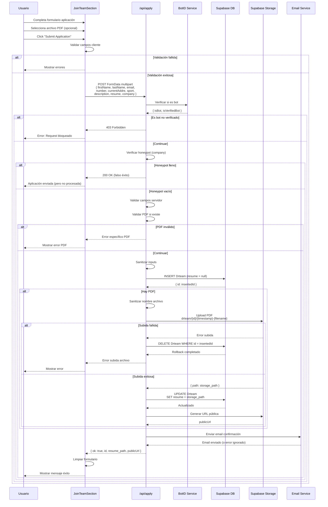
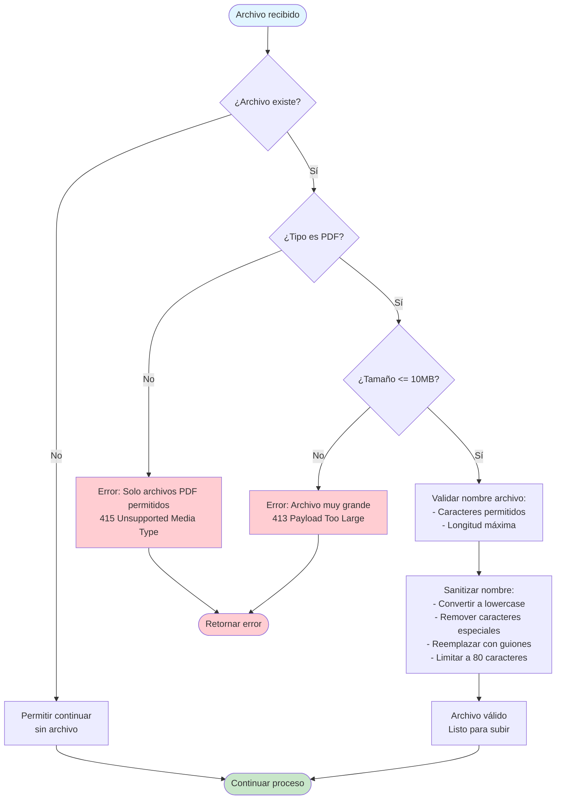
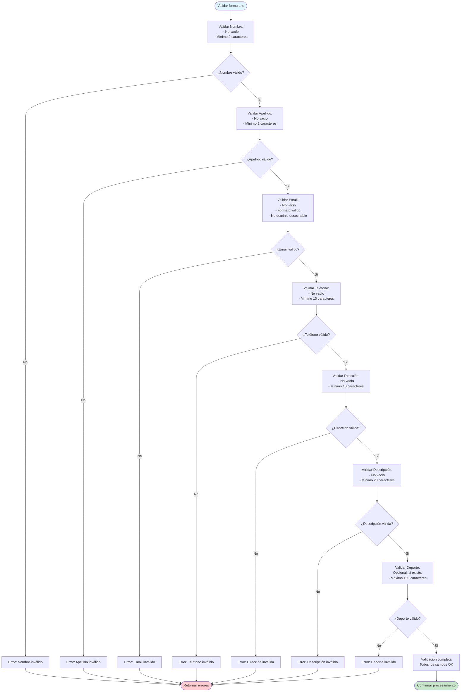
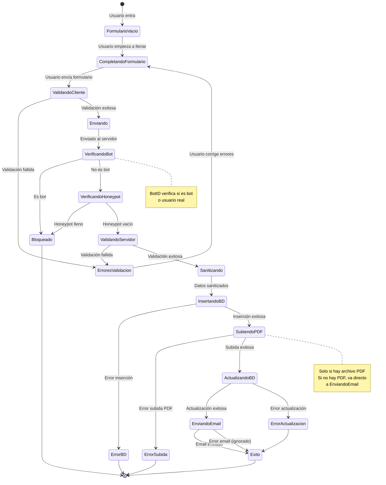

# Aplicación de Trabajo

Este documento describe el proceso de aplicación de trabajo para coaches, incluyendo validación anti-spam, subida de CV (PDF) y almacenamiento en Supabase.

## Descripción

El formulario de aplicación de trabajo permite a los candidatos aplicar para posiciones de coach en Discipline Rift. Incluye protección anti-spam mediante BotID y campo honeypot, validación de campos, subida de CV en formato PDF y almacenamiento en base de datos y storage de Supabase.

## Diagrama de Flujo Principal: Proceso de Aplicación

```mermaid
flowchart TD
    Start([Candidato completa formulario aplicación]) --> InputData[Usuario ingresa:<br/>- Nombre<br/>- Apellido<br/>- Email<br/>- Teléfono<br/>- Dirección<br/>- Deporte opcional<br/>- Descripción<br/>- CV PDF opcional<br/>- Campo honeypot oculto]
    
    InputData --> ValidateClient[Validar en cliente:<br/>- Campos requeridos<br/>- Formato email<br/>- Longitud mínima campos<br/>- Archivo PDF válido si existe]
    
    ValidateClient --> ClientValid{¿Validación OK?}
    ClientValid -->|No| ShowClientError[Mostrar errores en UI]
    ShowClientError --> InputData
    
    ClientValid -->|Sí| SubmitForm[Enviar formulario<br/>POST /api/apply<br/>FormData multipart]
    
    SubmitForm --> Step1[Paso 1: Verificar BotID<br/>checkBotId]
    Step1 --> BotCheck{¿Es bot?}
    
    BotCheck -->|Sí: Bot no verificado| BlockRequest[Bloquear request<br/>403 Forbidden]
    BlockRequest --> EndError([Request bloqueado])
    
    BotCheck -->|No: Usuario real| Step2[Paso 2: Verificar Honeypot<br/>Campo 'company']
    
    Step2 --> HoneypotCheck{¿Campo 'company' lleno?}
    HoneypotCheck -->|Sí| SilentBlock[Bloquear silenciosamente<br/>Retornar éxito falso]
    SilentBlock --> EndError
    
    HoneypotCheck -->|No| Step3[Paso 3: Validar campos servidor]
    
    Step3 --> ValidateServer[Validar:<br/>- Nombre mínimo 2 caracteres<br/>- Apellido mínimo 2 caracteres<br/>- Email formato válido<br/>- Teléfono mínimo 10 caracteres<br/>- Dirección mínimo 10 caracteres<br/>- Descripción mínimo 20 caracteres<br/>- Email no es dominio desechable]
    
    ValidateServer --> ServerValid{¿Validación OK?}
    ServerValid -->|No| ReturnError[Retornar error específico]
    ReturnError --> EndError
    
    ServerValid -->|Sí| Step4[Paso 4: Validar PDF si existe]
    Step4 --> PDFCheck{¿Hay archivo PDF?}
    
    PDFCheck -->|Sí| ValidatePDF[Validar PDF:<br/>- Tipo: application/pdf<br/>- Tamaño máximo: 10MB]
    ValidatePDF --> PDFValid{¿PDF válido?}
    PDFValid -->|No| ReturnPDFError[Retornar error PDF]
    ReturnPDFError --> EndError
    
    PDFValid -->|Sí| SanitizeFilename[Sanitizar nombre archivo]
    PDFCheck -->|No| Step5
    
    SanitizeFilename --> Step5[Paso 5: Sanitizar inputs]
    Step5 --> Sanitize[Sanitizar:<br/>- Remover caracteres peligrosos<br/>- Trim espacios<br/>- Normalizar email]
    
    Sanitize --> Step6[Paso 6: Insertar en BD]
    Step6 --> InsertDB[INSERT en tabla Drteam<br/>con resume = null inicialmente]
    
    InsertDB --> InsertResult{¿Insertado?}
    InsertResult -->|Error| ReturnDBError[Retornar error BD]
    ReturnDBError --> EndError
    
    InsertResult -->|Éxito| Step7[Paso 7: Subir PDF si existe]
    Step7 --> PDFUpload{¿Hay PDF?}
    
    PDFUpload -->|No| ReturnSuccess[Retornar éxito sin PDF]
    PDFUpload -->|Sí| UploadPDF[Subir PDF a Supabase Storage<br/>Bucket: resume<br/>Path: drteam/{id}/{timestamp}-{filename}]
    
    UploadPDF --> UploadResult{¿Subida exitosa?}
    UploadResult -->|Error| Rollback[Rollback: Eliminar registro BD]
    Rollback --> ReturnUploadError[Retornar error subida]
    ReturnUploadError --> EndError
    
    UploadResult -->|Éxito| Step8[Paso 8: Actualizar BD con path]
    Step8 --> UpdateDB[UPDATE Drteam<br/>SET resume = storage_path]
    
    UpdateDB --> UpdateResult{¿Actualizado?}
    UpdateResult -->|Error| LogUpdateError[Log error actualización<br/>Continuar proceso]
    UpdateResult -->|Éxito| Step9[Paso 9: Generar URL pública]
    
    LogUpdateError --> Step9
    Step9 --> GenerateURL[Generar URL pública<br/>del archivo en storage]
    
    GenerateURL --> Step10[Paso 10: Enviar email confirmación]
    Step10 --> SendEmail[Enviar email al candidato<br/>confirmando aplicación]
    
    SendEmail --> EmailResult{¿Email enviado?}
    EmailResult -->|Error| LogEmailError[Log error email<br/>Continuar proceso]
    EmailResult -->|Éxito| LogEmailSuccess[Log éxito email]
    
    LogEmailError --> ReturnSuccess
    LogEmailSuccess --> ReturnSuccess[Retornar éxito con datos]
    
    ReturnSuccess --> ShowSuccess[Mostrar mensaje éxito al usuario]
    ShowSuccess --> ClearForm[Limpiar formulario]
    ClearForm --> End([Proceso completado])
    
    style Start fill:#e1f5ff
    style ReturnSuccess fill:#c8e6c9
    style ShowSuccess fill:#c8e6c9
    style BlockRequest fill:#ffcdd2
    style SilentBlock fill:#ffcdd2
    style ReturnError fill:#ffcdd2
    style ReturnPDFError fill:#ffcdd2
    style ReturnDBError fill:#ffcdd2
    style ReturnUploadError fill:#ffcdd2
    style Step1 fill:#fff3cd
    style Step2 fill:#fff3cd
    style Step7 fill:#d1ecf1
    style Rollback fill:#f8d7da
```

## Diagrama de Secuencia: Proceso Completo de Aplicación



## Diagrama de Validación de PDF



## Diagrama de Proceso de Subida de Archivo con Rollback

```mermaid
flowchart TD
    Start([Registro creado en BD]) --> CheckPDF{¿Hay archivo PDF?}
    
    CheckPDF -->|No| ReturnSuccess[Retornar éxito<br/>sin archivo]
    
    CheckPDF -->|Sí| PrepareUpload[Preparar subida:<br/>- Convertir File a ArrayBuffer<br/>- Generar path único<br/>- Sanitizar nombre]
    
    PrepareUpload --> UploadFile[Subir a Supabase Storage<br/>Bucket: resume<br/>Path: drteam/{id}/{timestamp}-{filename}]
    
    UploadFile --> UploadResult{¿Subida exitosa?}
    
    UploadResult -->|Error| Rollback[ROLLBACK:<br/>Eliminar registro de BD<br/>DELETE Drteam WHERE id = insertedId]
    
    Rollback --> ReturnError[Retornar error<br/>al usuario]
    
    UploadResult -->|Éxito| UpdateDB[Actualizar registro BD<br/>UPDATE Drteam<br/>SET resume = storage_path]
    
    UpdateDB --> UpdateResult{¿Actualizado?}
    
    UpdateResult -->|Error| LogError[Log error actualización<br/>Archivo subido pero<br/>path no guardado]
    
    UpdateResult -->|Éxito| GenerateURL[Generar URL pública<br/>del archivo]
    
    LogError --> GenerateURL
    GenerateURL --> ReturnSuccess[Retornar éxito<br/>con URL pública]
    
    ReturnSuccess --> End([Proceso completado])
    ReturnError --> End
    
    style Start fill:#e1f5ff
    style ReturnSuccess fill:#c8e6c9
    style ReturnError fill:#ffcdd2
    style Rollback fill:#f8d7da
    style LogError fill:#fff3cd
```

## Diagrama de Validación de Campos del Formulario



## Diagrama de Estados: Estados de la Aplicación



## Referencias de Archivos

### Componentes
- `components/join-team-section.tsx` - Componente del formulario de aplicación
- `app/programs/page.tsx` - Página donde se muestra el formulario

### API Routes
- `app/api/apply/route.ts` - Endpoint de procesamiento de la aplicación

### Servicios
- `components/botid-client.tsx` - Cliente BotID para detección de bots
- `lib/supabase-admin.ts` - Cliente admin de Supabase para operaciones

### Base de Datos
- Tabla `Drteam` con campos:
  - `id` (UUID, primary key)
  - `firstName`
  - `lastName`
  - `email`
  - `number`
  - `currentAddre`
  - `sport` (opcional)
  - `description`
  - `resume` (path en storage, nullable)

### Storage
- Bucket: `resume`
- Estructura de paths: `drteam/{applicationId}/{timestamp}-{sanitized-filename}.pdf`

## Notas Importantes

### Protección Anti-Spam

1. **BotID**: Verificación de bots antes de procesar cualquier dato.
2. **Honeypot Field**: Campo oculto "company" que detecta bots automatizados.
3. **Doble Capa**: Ambas protecciones trabajan juntas para máxima seguridad.
4. **Bloqueo Silencioso**: Los bots reciben respuesta de éxito para no alertarlos.

### Validaciones

1. **Cliente y Servidor**: Validación en ambos lados.
2. **Longitudes Mínimas**: Previene spam de baja calidad.
3. **Dominios Desechables**: Bloquea emails temporales conocidos.
4. **Validación de PDF**: Tipo y tamaño estrictamente controlados.

### Manejo de Archivos

1. **Formato Único**: Solo se aceptan archivos PDF.
2. **Tamaño Máximo**: 10MB para prevenir abuso.
3. **Sanitización de Nombres**: Nombres de archivo se sanitizan antes de guardar.
4. **Paths Únicos**: Cada archivo tiene un path único basado en ID y timestamp.
5. **Rollback**: Si la subida falla, se elimina el registro de BD.

### Manejo de Errores

1. **Errores Específicos**: Mensajes claros para cada tipo de error.
2. **Rollback Automático**: Si falla la subida de PDF, se revierte la inserción en BD.
3. **Errores No Bloqueantes**: Errores de email no bloquean el proceso.
4. **Logging**: Todos los errores se registran para debugging.

### Seguridad

1. **Sanitización**: Todos los inputs se sanitizan antes de usar.
2. **Validación de Tipos**: Validación estricta de tipos de archivo.
3. **Paths Seguros**: Los paths de archivos se generan de forma segura.
4. **Sin Exposición**: Los datos no se exponen en URLs o logs.

### UX

1. **Feedback Inmediato**: Validación en tiempo real.
2. **Mensajes Claros**: Errores específicos y accionables.
3. **Archivo Opcional**: El CV es opcional, no bloquea la aplicación.
4. **Confirmación**: Email de confirmación al candidato.

