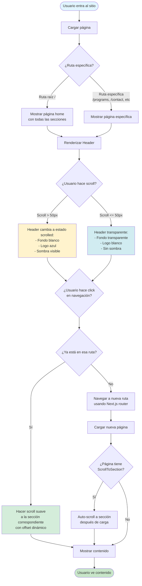
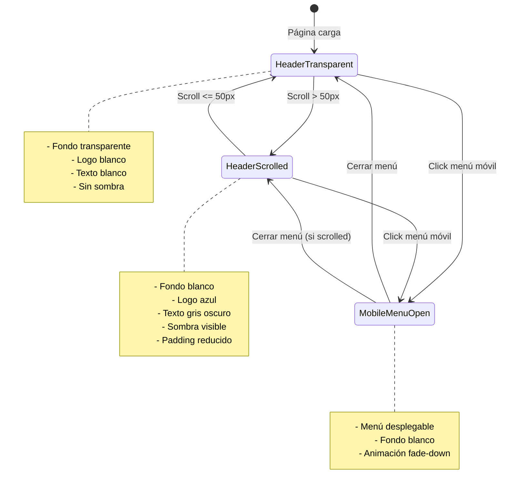
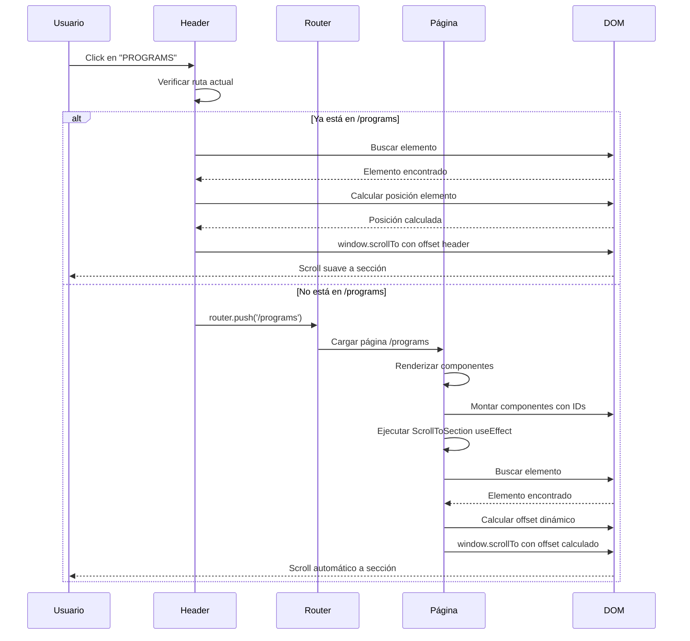
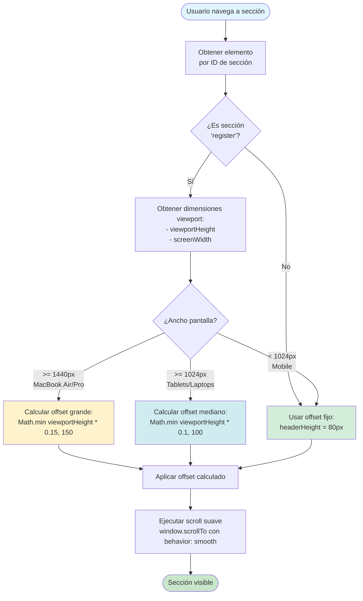
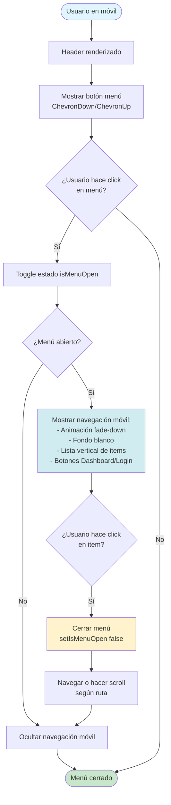
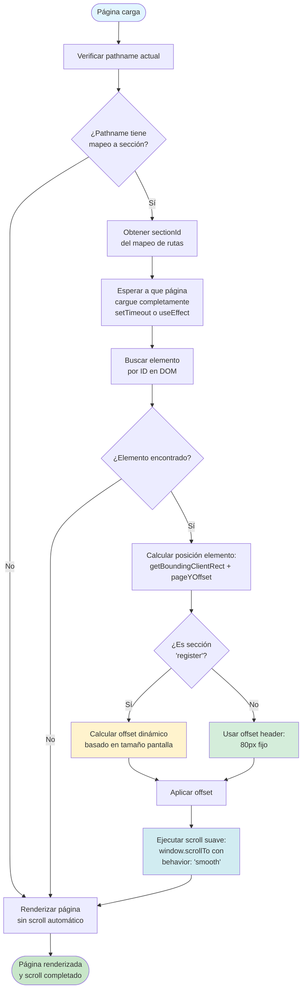
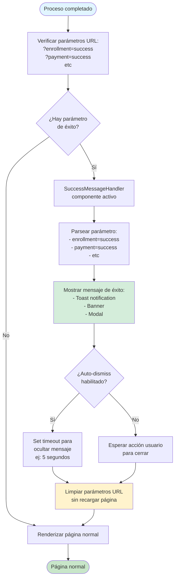
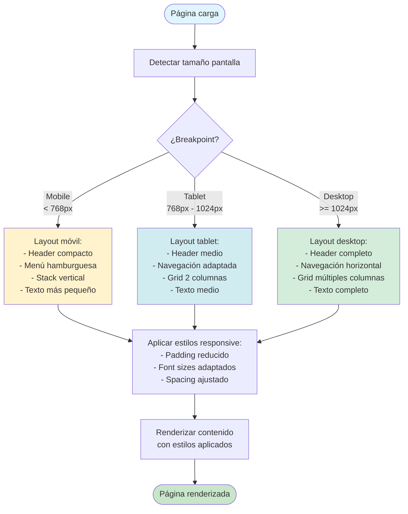

# Navegación y UI/UX

Este documento describe los procesos de navegación, interacciones de usuario y patrones de UI/UX del frontend de Discipline Rift.

## Descripción

El sistema de navegación incluye navegación por rutas y scroll a secciones, header dinámico que cambia según el scroll, navegación móvil responsive, y patrones de UI consistentes en toda la aplicación.

## Diagrama de Flujo: Sistema de Navegación Principal



## Diagrama de Estados: Header Dinámico



## Diagrama de Secuencia: Navegación con Scroll a Sección



## Diagrama de Flujo: Cálculo de Offset Dinámico para Scroll



## Diagrama de Flujo: Navegación Móvil



## Diagrama de Flujo: Proceso de Scroll Automático al Cargar Página



## Diagrama de Estructura: Rutas y Secciones

```mermaid
graph TD
    Root[Página Raíz /] --> Home[Home Page]
    
    Home --> Section1[#programs<br/>ProgramShowcase]
    Home --> Section2[#experience<br/>ExperienceSection]
    Home --> Section3[#club<br/>ClubSection]
    Home --> Section4[#faq<br/>FaqSection]
    Home --> Section5[#contact<br/>ContactSection]
    Home --> Section6[#join-team<br/>JoinTeamSection]
    Home --> Section7[#register<br/>RegisterSection]
    
    Root --> ProgramsPage[/programs]
    ProgramsPage --> Section1
    ProgramsPage --> Section2
    ProgramsPage --> Section3
    ProgramsPage --> Section4
    ProgramsPage --> Section5
    ProgramsPage --> Section6
    ProgramsPage --> Section7
    
    Root --> ContactPage[/contact]
    ContactPage --> Section5
    
    Root --> RegisterPage[/register]
    RegisterPage --> Section7
    
    Root --> DashboardPage[/dashboard]
    DashboardPage --> ParentDashboard[ParentDashboard Component]
    
    Root --> AdminPage[/admin/login]
    AdminPage --> AdminLogin[AdminLogin Component]
    
    Root --> AuthPages[/auth/*]
    AuthPages --> ConfirmedPage[/auth/confirmed]
    AuthPages --> ErrorPage[/auth/error]
    AuthPages --> ForgotPassword[/auth/forgot-password]
    AuthPages --> ResetPassword[/auth/reset-password]
    
    Root --> PaymentPages[/payment/*]
    PaymentPages --> ConfirmPage[/payment/confirm]
    PaymentPages --> CancelPage[/payment/cancel]
    
    style Root fill:#e1f5ff
    style Home fill:#c8e6c9
    style ProgramsPage fill:#fff3cd
    style DashboardPage fill:#d1ecf1
    style AdminPage fill:#f8d7da
```

## Diagrama de Componentes UI: Sistema de Componentes

```mermaid
graph TD
    UI[UI Components] --> Button[Button]
    UI --> Input[Input]
    UI --> Card[Card]
    UI --> Dialog[Dialog]
    UI --> Badge[Badge]
    UI --> Tabs[Tabs]
    UI --> Avatar[Avatar]
    UI --> Alert[Alert]
    UI --> Separator[Separator]
    UI --> Switch[Switch]
    
    Layout[Layout Components] --> Header[Header]
    Layout --> ScrollProgress[ScrollProgress]
    Layout --> AnimatedSection[AnimatedSection]
    Layout --> SectionBackground[SectionBackground]
    
    Features[Feature Components] --> ContactSection[ContactSection]
    Features --> RegisterSection[RegisterSection]
    Features --> JoinTeamSection[JoinTeamSection]
    Features --> ProgramShowcase[ProgramShowcase]
    Features --> ExperienceSection[ExperienceSection]
    Features --> ClubSection[ClubSection]
    Features --> FaqSection[FaqSection]
    
    Auth[Auth Components] --> AdminLogin[AdminLogin]
    Auth --> ParentDashboard[ParentDashboard]
    Auth --> StudentManagement[StudentManagement]
    
    Utils[Utility Components] --> EmailSignupManager[EmailSignupManager]
    Utils --> SuccessMessageHandler[SuccessMessageHandler]
    Utils --> SupabaseStatus[SupabaseStatus]
    Utils --> BotIdClient[BotIdClient]
    
    style UI fill:#e1f5ff
    style Layout fill:#c8e6c9
    style Features fill:#fff3cd
    style Auth fill:#d1ecf1
    style Utils fill:#f8d7da
```



## Diagrama de Flujo: Manejo de Mensajes de Éxito



## Diagrama de Responsive Design: Breakpoints y Adaptaciones



## Referencias de Archivos

### Componentes de Navegación
- `components/header.tsx` - Componente principal del header con navegación
- `components/scroll-progress.tsx` - Barra de progreso de scroll

### Componentes de Layout
- `app/layout.tsx` - Layout raíz con metadata y SEO
- `app/page.tsx` - Página principal con todas las secciones
- `app/programs/page.tsx` - Página de programas con scroll automático

### Componentes de UI
- `components/ui/button.tsx` - Componente Button reutilizable
- `components/ui/input.tsx` - Componente Input reutilizable
- `components/ui/card.tsx` - Componente Card reutilizable
- `components/ui/dialog.tsx` - Componente Dialog reutilizable
- `components/ui/*` - Otros componentes UI de shadcn/ui

### Componentes de Utilidad
- `components/animated-section.tsx` - Componente para animaciones de secciones
- `components/success-message-handler.tsx` - Manejo de mensajes de éxito
- `components/scroll-progress.tsx` - Indicador de progreso de scroll

### Rutas Principales
- `/` - Página home
- `/programs` - Página de programas
- `/contact` - Página de contacto
- `/register` - Página de registro
- `/dashboard` - Dashboard de padres
- `/admin/login` - Login de administración
- `/auth/*` - Rutas de autenticación
- `/payment/*` - Rutas de pago

## Notas Importantes

### Navegación

1. **Dual Navigation**: El sistema soporta navegación por rutas y scroll a secciones.
2. **Scroll Inteligente**: Offset dinámico según tamaño de pantalla para mejor UX.
3. **Estado del Header**: El header cambia visualmente según el scroll para mejor visibilidad.
4. **Navegación Móvil**: Menú hamburguesa con animación fade-down.

### UX Patterns

1. **Scroll Suave**: Todos los scrolls usan `behavior: 'smooth'` para transiciones fluidas.
2. **Auto-scroll**: Al navegar a rutas específicas, se hace scroll automático a la sección correspondiente.
3. **Offset Dinámico**: Para la sección de registro, se calcula offset dinámico según tamaño de pantalla.
4. **Feedback Visual**: El header cambia de estado para dar feedback visual del scroll.

### Responsive Design

1. **Breakpoints**: 
   - Mobile: < 768px
   - Tablet: 768px - 1024px
   - Desktop: >= 1024px
2. **Adaptación**: Componentes se adaptan automáticamente según breakpoint.
3. **Navegación Móvil**: Menú hamburguesa en móviles, navegación horizontal en desktop.

### Performance

1. **Lazy Loading**: Componentes se cargan bajo demanda.
2. **Optimización de Imágenes**: Uso de Next.js Image component para optimización.
3. **Scroll Events**: Throttling de eventos de scroll para mejor performance.
4. **Code Splitting**: Rutas se dividen automáticamente por Next.js.

### Accesibilidad

1. **ARIA Labels**: Botones tienen labels descriptivos.
2. **Keyboard Navigation**: Navegación por teclado soportada.
3. **Screen Readers**: Texto alternativo en imágenes y elementos interactivos.
4. **Focus Management**: Manejo adecuado del foco en navegación.

### SEO

1. **Metadata**: Metadata completa en layout.tsx.
2. **Structured Data**: JSON-LD para Organization, LocalBusiness, WebSite.
3. **Canonical URLs**: URLs canónicas configuradas.
4. **Open Graph**: Tags Open Graph para redes sociales.

